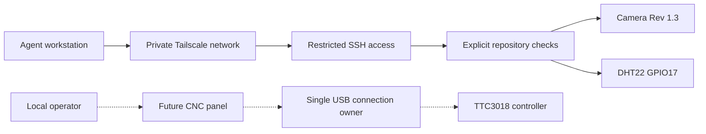

# System boundaries

The repository owns host setup and monitoring. The operator owns physical work.
Solid arrows below represent implemented access; dotted links are planned.

Implemented: setup script, version-locked Python environment, host diagnostics,
bounded sensor test and one-shot camera capture command.

Pending: continuous camera streaming, persistent environmental telemetry, private
web dashboard, CNC sender and a narrow agent application programming interface
(API). These require separate implementation and acceptance tests. Do not present
their proposed configuration as deployed. A camera still is not a live stream.

Future agent access should favor compact structured status and on-demand images.
The operator can watch continuous video without sending each frame to a model.
A CNC adapter should use the single sender's API, never open a competing USB
connection. Starting motion or spindle operation remains operator-controlled.
