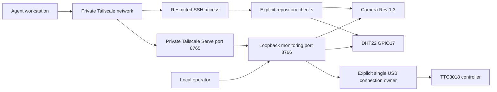

# System boundaries

The repository owns host setup and monitoring. The operator owns physical work.
Solid arrows below represent implemented access. File streaming is pending.

Implemented: setup script, version-locked Python environment, host diagnostics,
bounded sensor test, camera snapshot command and a persistent monitoring service.
The browser receives Motion JPEG (MJPEG), a sequence of JPEG images, at 960 x 540
and 8 frames per second. One `rpicam-vid` process serves all viewers. At most four
streams run simultaneously; slow clients receive the latest frame, not a queue.
One DHT22 worker reads every five seconds. Errors and sample ages remain visible.

The service listens only on `127.0.0.1:8766`. Tailscale Serve exposes port 8765
only within the private tailnet; there is no LAN listener or public Funnel.
Tailscale encrypts network transport even though the browser URL uses HTTP.
Tailnet access rules, not a separate application password, control access. Review
those rules before sharing the node or adding untrusted tailnet members.
There is no external web dependency, analytics, continuous disk recording or
historical sensor database. Latest values and one latest frame are held in memory.

Read-only application programming interface (API): `/api/status` and `/camera.jpg`.
Snapshot access uses the existing camera worker. Manual operator actions use
POST `/api/cnc/action` with a per-process cross-site request protection token.
USB opens only after explicit connection, never at service startup. One lock
serializes all controller I/O. Status is cached; stale positions are unavailable.

Pending: file sender and dedicated read-only CNC agent integration.
A service restart closes USB but does not promise to stop the spindle. Restart
only with the machine idle and spindle physically confirmed off.

Future agent access should favor compact structured status and on-demand images.
The operator can watch continuous video without sending each frame to a model.
A CNC adapter should use the single sender's API, never open a competing USB
connection. Starting motion or spindle operation remains operator-controlled.
